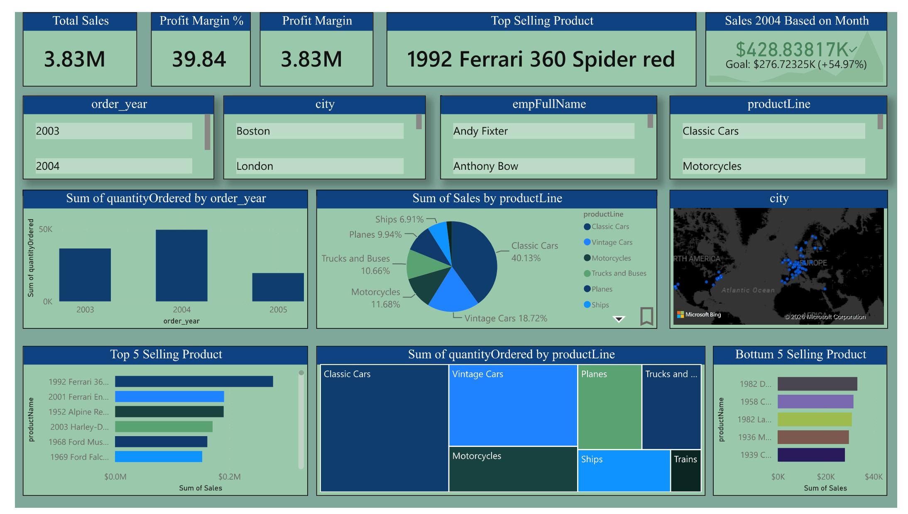
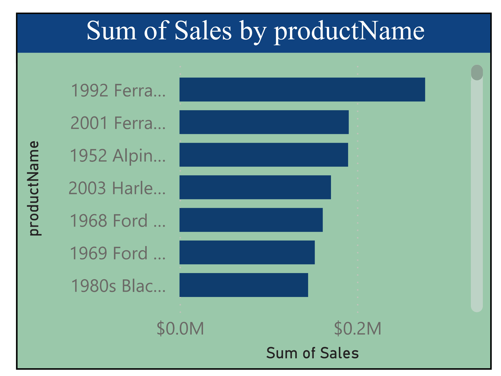
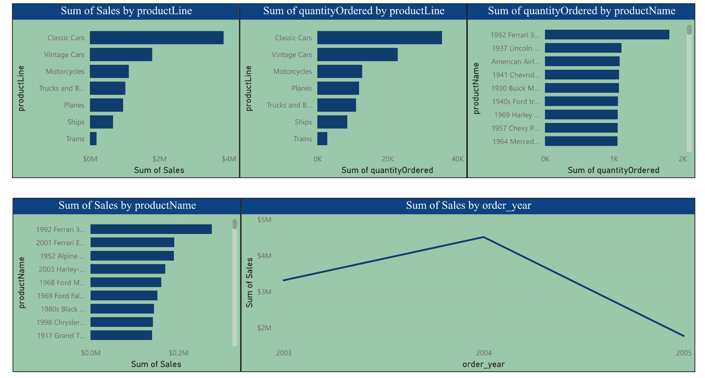
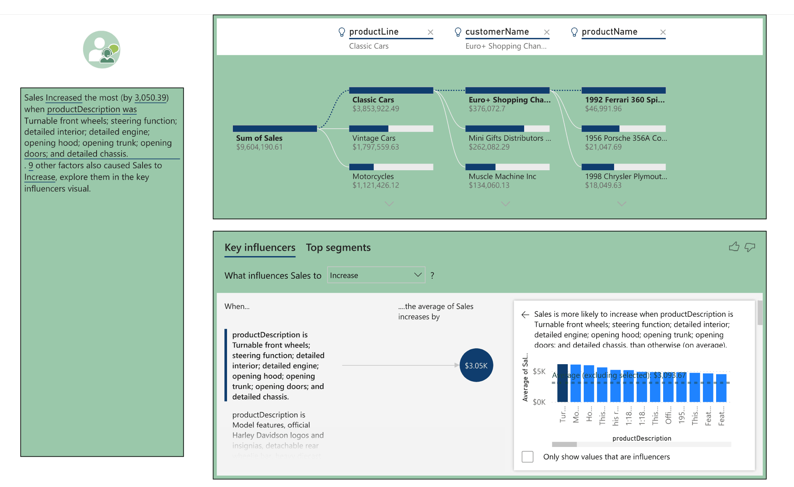

# Car Sales Dashboard – Power BI

## Project Overview

This Power BI dashboard provides an interactive analysis of car sales data using the Classic Models dataset. The dashboard helps users explore sales performance, profit metrics, product trends, employee contributions, and geographic distribution of customers through dynamic visualizations and slicers.

## Dataset Tables

The project uses the following tables:

* Customers
* Employees
* Offices
* Orders
* Order Details
* Payments
* Products
* Product Lines

These tables are connected through a relational data model to support comprehensive business analysis.

## Dashboard Features

### Key Performance Indicators (KPIs)

* Total Sales
* Profit Margin %
* Total Profit
* Top Selling Product

### Interactive Filters

Users can filter the dashboard by:

* Order Year
* Customer City
* Employee Name
* Product Line

### Visualizations

* Sales by Product Line (Pie Chart)
* Quantity Ordered by Product Line (Treemap)
* Quantity Ordered by Year (Column Chart)
* Sales Distribution by City (Map)
* Top 5 Selling Products (Bar Chart)
* Bottom 5 Selling Products (Bar Chart)

## Key Insights

* Identify the highest-selling car products.
* Compare sales performance across product lines.
* Analyze yearly sales trends.
* Track geographic distribution of customers.
* Evaluate employee-related sales performance.
* Discover top-performing and low-performing products.

## Tools Used

* Power BI Desktop
* Power Query
* DAX (Data Analysis Expressions)
* Excel Dataset

## Skills Demonstrated

* Data Modeling
* Data Cleaning and Transformation
* DAX Measures and KPIs
* Interactive Dashboard Design
* Business Intelligence Reporting
* Data Visualization

## Project Outcome

This dashboard transforms raw sales data into actionable business insights, enabling better decision-making regarding product performance, sales trends, and customer distribution.

## Dashboard Preview

### Main Dashboard


### Tooltip


### Sales Analysis


### Key Influencers & Narrative

## Project Structure

```text
powerbi-sales-dashboard/
│
├── classicmodels_dashboard.pbix
├── dashboard-home.png
├── dashboard.pdf
├── README.md
│
└── dataset/
    ├── customers.xlsx
    ├── employees.xlsx
    ├── offices.xlsx
    ├── orders.xlsx
    ├── order_details.xlsx
    ├── payments.xlsx
    ├── productlines.xlsx
    └── products.xlsx
```
